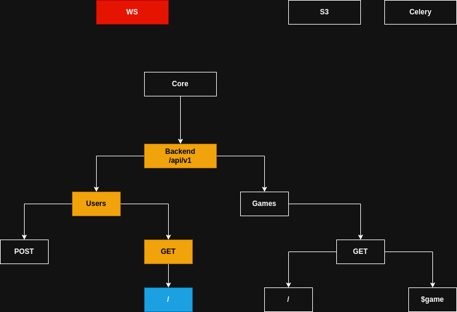

<p align="center"></p>

Core
```bash
cd core
# Generate migration
uv run alembic revision --autogenerate -m "Added user table"
# Apply generated migration
uv run alembic upgrade +1
# Apply all migrations
uv run alembic upgrade head
```

Backend
```bash
uv run litestar --app main:app run -r
```

Frontend
```bash
cd frontend
npm run dev
```

