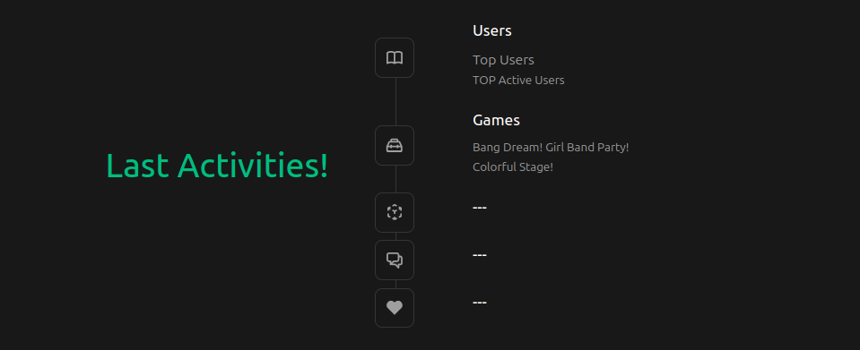

<p align="center"></p>

> [!NOTE]
> Brief: [Diagram](./data/README.md)

Core
```bash
cd core
# Generate migration
uv run alembic revision --autogenerate -m "msg"
# Apply generated migration
uv run alembic upgrade +1
# Apply all migrations
uv run alembic upgrade head
```

Backend
```bash
cd backend
uv run litestar --app main:app run -r
```

Frontend
```bash
cd frontend
npm run dev
```

Directory Structure
```
# tree . --dirsfirst -d -I node_modules -I data -I __pycache__ -L 2
.
├── backend
│   └── api
├── core
│   ├── alembic
│   └── core
└── frontend
    ├── public
    └── src
```
